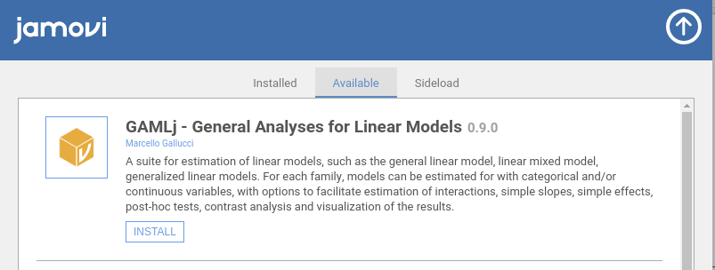

# GAMLj Suite for Linear Models in Jamovi

General, Mixed and Generalized Models module for Jamovi

version 0.9.*


Estimates a General Linear Model, Mixed Linear Models and Generalized Linear Model (the latter yet to be implemented) with categorial and/or continuous variables, with options to facilitate estimation of interactions, simple slopes, simple effects, post-hoc etc.


* Continuous and categorical independent and dependent variables
* F-test and parameter estimates
* Confidence intervals
* Moderation made easy
* Simple slopes analysis
* Simple effects
* post-hocs analysis
* Plots up to three-way interactions
* Automatic selection of best estimation methods and degrees of freedom selection
* Type III estimation

More informations can be found at [GAMLj page](https://mcfanda.github.io/gamlj_docs/)

# Installation

Please install [Jamovi](https://www.jamovi.org/download.html) and run it. Select the jamovi modules library and install GAMLj from there



## From source

## Linux

If you are working in linux you can download [Jamovi](https://www.jamovi.org/download.html), then download the .jmo from this link [gamlj binaries](https://github.com/mcfanda/binaries/blob/master/gamlj_linux.jmo).


## Others

You will first need to download [Jamovi](https://www.jamovi.org/download.html). 


You can clone this repository and compile the module within R with 

```
library(jmvtools)

jmvtools::install()

```

# Troubleshooting

## While using the module

Please check out the  [troubleshooting page](https://mcfanda.github.io/gamlj_docs/troubles.html). 


## Installing from source

The modules installs dependencies automatically, but in some R installations the process seems to fail when it comes to the dependencies. The solution is to install in the module build folder the required package that fails before installing the module. For example, if "pbkrtest" fails and you cloned the source in YOURCLONEFOLDER folder, run this before installing the module.


```
package<-"pbkrtest"
dirroot<-YOURCLONEFOLDER
instdir<-paste0(dirroot,"/build/R")
install.packages(package,lib = instdir)


```


