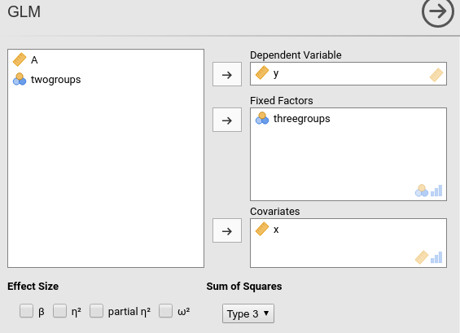
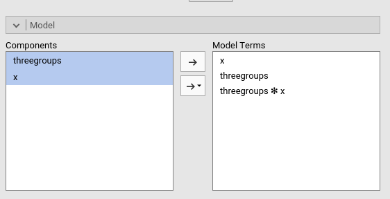
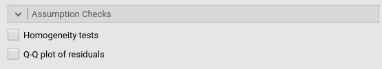
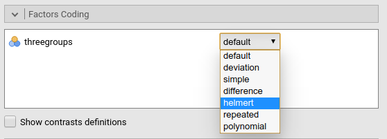
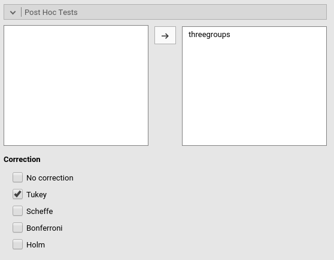

# GAMLj suite: the GLM module

**General Linear Model** module of the GAMLj suite for jamovi


The module estimate a general linear model with categorial and/or continuous variables, with options to facilitate estimation ofinteractions, simple slopes, simple effects, etc.

## Module
The module can estimates OLS linear models for any combination of categorical and continuous variables, thus providing an easy way for multiple regression, ANOVA, ANCOVA and moderation analysis. 



## Estimates
The module provides ANOVA tables and parameter estimates for any estimated model. Effect size (eta, omega, and beta) are optionally computed
Variables definition follows jamovi standards, with categorical independent variables defined in "fixed factors" and continuous independent variables in "covariates".

Effect size index are optionally computed by selecting the following options:

  - __beta__ : standardized regression coefficients. Continuous variables are standardized and categorical ones are contrast coded (-1 0 1) before estimating the parameters.
  - __eta^2__: "semi-partial" eta-squared computed as the sum-of-squares of the effect divided by the total sum-of-square.
  - partial __eta^2__: partial eta-squared computed as the sum-of-squares of the effect divided by the  sum-of-squares of the effect plus the sum-of-squares of error.
  - __omega^2__: omega-squared 

## Model 


By default, the model terms are filled in automatically for main effects and for interactions with categorical variables. 


Interactions between continuous variables or categorical and continuous can be set by clicking the second arrow icon.

## Assumptions checks



Provides Levene's test of variance homegeneity for categorical independent variables groups and Q-Q plots for model residuals

## Factors coding


It allows to code the categorical variables accoring to different coding schemes. The coding scheme applies to the parameter estimates, simple effects and plots. The ANOVA table uses always the "deviation" scheme, that is "-1 0 1" coding. _default_ uses the factor coding "contr.sum", that is the -1 0 1 coding which results in appropriated Type III Sum of Squares.

Contrasts definitions are provided in the estimates table. More detailed definitions of the comparisons operated by the contrasts can be obtained by selecting "Show contrast definition table". 

### Contrasts Naming scheme
Differently to standard R naming system, contrasts variables are always named with the name of the factor and progressive numbers from 1 to K-1, where K is the number of levels of the factor.

## Covariates Scaling


Continuous variables can be centered, standardized or used as they are ("none", the default)


## Post-hocs


Major post-hoc tests can be accomplished for the categorical variables groups by selecting the appropriated factor and tick the required tests

## Plots


The "plots" menu allows for plotting  main effects and interactions for any combination of types of variables, 
making it easy to plot interaction means plots, simple slopes, and combinations of them. The best plot is chosen automatically.

By filling in "Horizontal axis" one obtains the group means of the selected factor or the regression line for the selected covariate

By filling in "Horizontal axis" and "Separated lines" one a different plot depending on the type of variables selected:
  - "Horizontal axis" and "Separated lines" are both factos, one obtains the interaction plot of group means.
  - "Horizontal axis"=factor and "Separated lines"=covariate. One obtains the plot of group means of the factor estimated at three different levels of the covariate. +1 SD, the mean, and -1 SD.
  - "Horizontal axis"=covariate and "Separated lines"=covariate. One obtains the simple slopes graph of the simple slope of the variable in horizontal axis estimated at three different levels of the covariate. +1 SD, the mean, and -1 SD.
  
By filling in "separate plots" one can proble three-way interactions. If the selected variable is a factor, one obtains a two-way graph (as previously defined) for each level of the "separate plots" variable. If the selected variable is a covariate, one obtains a two-way graph (as previously defined) for the "separate plots" variable centered to +1SD, the mean, and -1SD.

Ticking the options add confidence intervals (or confidence bands) or standard errors to the plots

## Simple effects
Simple effects can be computed for any combination of types of variables, 
making it easy to proble interaction, simple slopes, and combinations of them. 
Simple effects can estimated  up to a three-way interaction.

Simple effects are computed following the same logic of the plots. They correspond to the plotted effects as defined above.

## Additional options

print the means for the estimated values by groups (needs development)

# Installation

You can clone this repository and compile the module within R with 

``` jmvtools::install() ```

or, without cloning anything, just run this within R


```
library("devtools")
install_github("mcfanda/gamlj_glm")
```

