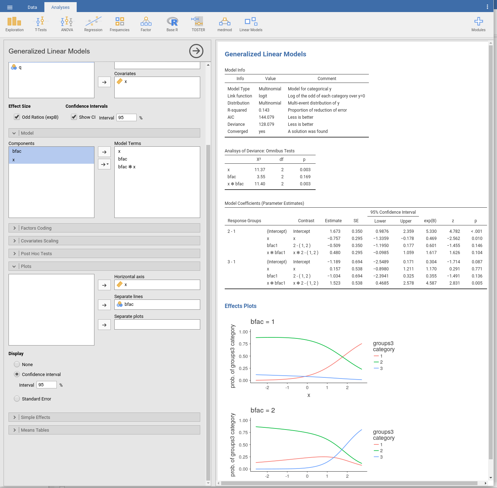
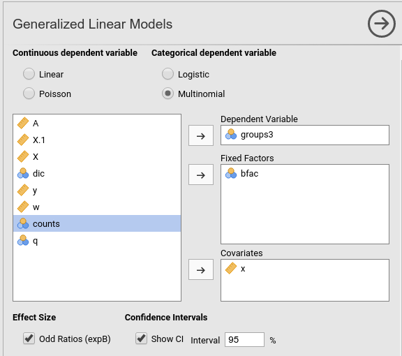
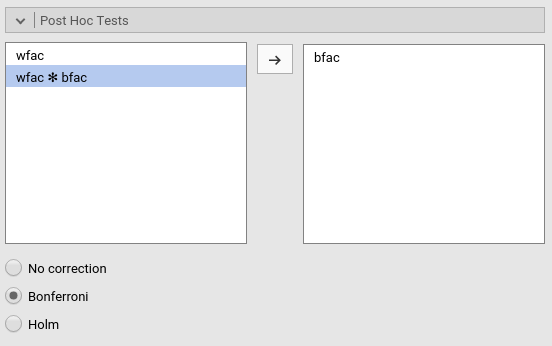
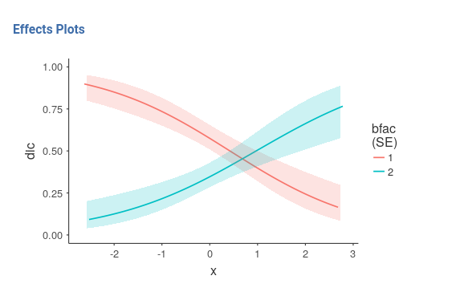
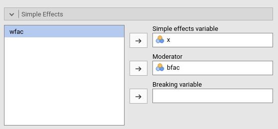
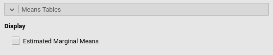

**Generalized Linear Models** module of the GAMLj suite for jamovi

The module estimates generalized linear models with categorial and/or continuous  dependent and independent variables, with options to facilitate estimation ofinteractions, simple slopes, simple effects, etc.

# Module
The module can estimates several linear models:

* Linear model
* Poisson model
* Logistic model
* Multinomial model

For each model, any combination of categorical and continuous variables can be set as independent variables, thus providing an easy way for multiple regression, ANOVA, ANCOVA and moderation analysis for categorical and count dependent variables. 

Model are defined based on the link function (LF) and the dependent variable distribution, thus allowing to model different type of dependent variables:

* Linear model: identity LF, gaussian distribution, yielding a general linear model for continuous dependent variables.
* Poisson model: logaritm LF, poisson distribution, modelling count dependent variables. This model is often called log-linear models when the independent variables are all categorical.
* Logistic model: logit LF, binomial distribution, modelling dichotomous dependent variables.
* Multinomial model: logit LF, multinomial distribution, modelling categorical dependent variables. 

# Estimates
The module provides Analysis of Deviance tables and parameter estimates for any estimated model. Variables definition follows jamovi standards, with categorical independent variables defined in "fixed factors" and continuous independent variables in "covariates".

Effect size index are optionally computed by selecting `Odd rations (expB)`. Odd ratios apply the exponential function to the parameter estimates, thus make sense for all model where the link function is based on the logaritm.

# Model 

By default, the model terms are filled in automatically for main effects and for interactions with categorical variables. 

Interactions between continuous variables or categorical and continuous can be set by clicking the second arrow icon.

# Factors coding

It allows to code the categorical variables accoring to different coding schemes. The coding scheme applies to the parameter estimates, simple effects and plots. The ANOVA table uses always the "deviation" scheme, that is "-1 0 1" coding. _default_ uses the factor coding "contr.sum", that is the -1 0 1 coding which results in appropriated "Type III" estimates.

Contrasts definitions are provided in the estimates table. More detailed definitions of the comparisons operated by the contrasts can be obtained by selecting "Contrasts definition table". 

Details of the contrasts definition can be found [here](https://stats.idre.ucla.edu/r/library/r-library-contrast-coding-systems-for-categorical-variables/)

# Contrasts Naming scheme
Differently to standard R naming system, contrasts variables are always named with the name of the factor and progressive numbers from 1 to K-1, where K is the number of levels of the factor.

# Covariates Scaling

Continuous variables can be centered, standardized or used as they are ("none", the default)

# Post-hocs

Post-hoc tests can be accomplished for the categorical variables groups by selecting the appropriated factor and tick the required tests. Available corrections are Bonferroni and Holm.

# Plots

The "plots" menu allows for plotting  main effects and interactions for any combination of types of variables, 
making it easy to plot interaction means plots, simple slopes, and combinations of them. The best plot is chosen automatically.

By filling in "Horizontal axis" one obtains the group means of the selected factor or the regression line for the selected covariate

By filling in "Horizontal axis" and "Separated lines" one a different plot depending on the type of variables selected:
  - "Horizontal axis" and "Separated lines" are both factos, one obtains the interaction plot of group means.
  - "Horizontal axis"=factor and "Separated lines"=covariate. One obtains the plot of group means of the factor estimated at three different levels of the covariate. +1 SD, the mean, and -1 SD.
  - "Horizontal axis"=covariate and "Separated lines"=covariate. One obtains the simple slopes graph of the simple slope of the variable in horizontal axis estimated at three different levels of the covariate. +1 SD, the mean, and -1 SD.
  
By filling in "separate plots" one can proble three-way interactions. If the selected variable is a factor, one obtains a two-way graph (as previously defined) for each level of the "separate plots" variable. If the selected variable is a covariate, one obtains a two-way graph (as previously defined) for the "separate plots" variable centered to +1SD, the mean, and -1SD.

Ticking the options add confidence intervals (or confidence bands) or standard errors to the plots.

Plots interpretation varies depending on the model being estimated. All plots are, however, depicting predicted values in the response original scale (usually probabilities). See details and interpretation discussion.

# Simple effects

Simple effects can be computed for any combination of types of variables, 
making it easy to proble interaction, simple slopes, and combinations of them. 
Simple effects can estimated  up to a three-way interaction.

Simple effects are computed following the same logic of the plots. They correspond to the plotted effects as defined above.

# Estimated marginal means

Print the estimate expected means, SE, df and confidence intervals of the dependent variable by factors in the model.

