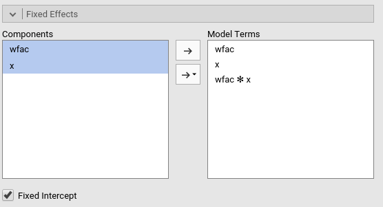
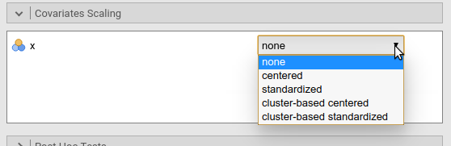
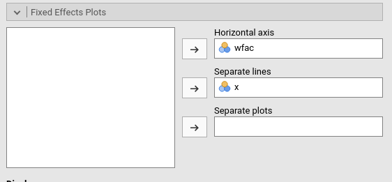
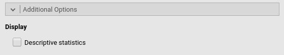

**Mixed Linear Models** module of the GAMLj suite for jamovi

The module estimate a mixed linear model with categorial and/or continuous variables, with options to facilitate estimation of interactions, simple slopes, simple effects, post-hoc, etc. In this page you can find some hint to get started with the mixed models module. For more information about how to module works, please check the [technical details](mixed_specs.html)
 

# Module
The module can estimates REML and ML linear mixed models for any combination of categorical and continuous variables, thus providing an easy way of obtaining multilevel or hierarchical linear models for any combination of independent variables types.

# Estimates
The module provides a parameter estimates of the fixed effects, the random variances and correlation among random coefficients.

Variables definition follows jamovi standards, with categorical independent variables defined in "fixed factors" and continuous independent variables in "covariates".

The grouping variable is simply set by putting the corresponding variable(s) into "cluster". In this version, multiple clustering variables are possible, but not nested classifications. 

REML or ML can be chosen.

The actual estimation occurs when the dependent variable, the clustering variable and at least one random coefficient (random effect) has been selected.

# Random effects

Random effects across clustering variables are automatically prepared by the module following R lmer() standards: `term | cluster` indicates a that the coefficient associated with `term` is random across `cluster`. 

BY default the module assumes correlated random effects. A variance component model can be estimated by de-selecting "Correlated Effects" options.

# Fixed effects Model 

By default, the model fixed effects terms are filled in automatically for main effects and for interactions with categorical variables. 

Interactions between continuous variables or categorical and continuous can be set by clicking the second arrow icon.

# Factors coding

It allows to code the categorical variables accoring to different coding schemes. The coding scheme applies to the parameter estimates, simple effects and plots. The ANOVA table uses always the "deviation" scheme, that is "-1 0 1" coding. _default_ uses the factor coding "contr.sum", that is the -1 0 1 coding which results in appropriated Type III Sum of Squares.

Note that all contrasts, when employed in the model, guarantees to be centered to zero (intercept being the grand mean ), so when involved in interactions their coefficients can be interpret as (main) average effects.

Contrasts definitions are provided in the estimates table. More detailed definitions of the comparisons operated by the contrasts can be obtained by selecting "Show contrast definition table". 

## Contrasts Naming scheme

Differently to standard R naming system, contrasts variables are always named with the name of the factor and progressive numbers from 1 to K-1, where K is the number of levels of the factor.

# Covariates Scaling

Continuous variables can be centered, standardized or used as they are ("none", the default). Both centering and standardization can be obtained based on the whole sample mean and SD, or cluster-based. Cluster based standardization uses the mean and the SD of each cluster.

# Post-hocs

Major post-hoc tests can be accomplished for the categorical variables groups by selecting the appropriated factor and tick the required tests

Post-hoc are always computed on the expected means (LSMEANS). 

# Fixed Effects Plots

The "plots" menu allows for plotting  fixed main effects and fixed interactions for any combination of types of variables, 
making it easy to plot interaction means plots, simple slopes, and combinations of them. The best plot type is chosen automatically.

By filling in "Horizontal axis" one obtains the group means of the selected factor or the regression line for the selected covariate

By filling in "Horizontal axis" and "Separated lines" one a different plot depending on the type of variables selected:
  - "Horizontal axis" and "Separated lines" are both factos, one obtains the interaction plot of group means.
  - "Horizontal axis"=factor and "Separated lines"=covariate. One obtains the plot of group means of the factor estimated at three different levels of the covariate. +1 SD, the mean, and -1 SD.
  - "Horizontal axis"=covariate and "Separated lines"=covariate. One obtains the simple slopes graph of the simple slope of the variable in horizontal axis estimated at three different levels of the covariate. +1 SD, the mean, and -1 SD.
  
By filling in "separate plots" one can proble three-way interactions. If the selected variable is a factor, one obtains a two-way graph (as previously defined) for each level of the "separate plots" variable. If the selected variable is a covariate, one obtains a two-way graph (as previously defined) for the "separate plots" variable centered to +1SD, the mean, and -1SD.

Ticking the options add confidence intervals (or confidence bands) or standard errors to the plots does not do anything (yet to be implemented)

# Simple effects

Simple effects for the fixed effects can be computed for any combination of types of variables, 
making it easy to proble interaction, simple slopes, and combinations of them. 
Simple effects can estimated  up to a three-way interaction.

Simple effects are computed following the same logic of the plots. They correspond to the plotted effects as defined above.

# Additional options

Print the means for the estimated values by groups (needs development)

# [Technical Details](mixed_specs.html)
