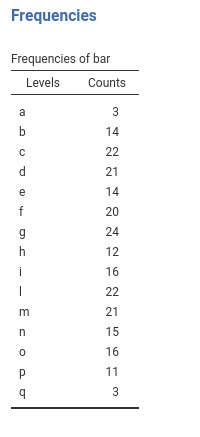
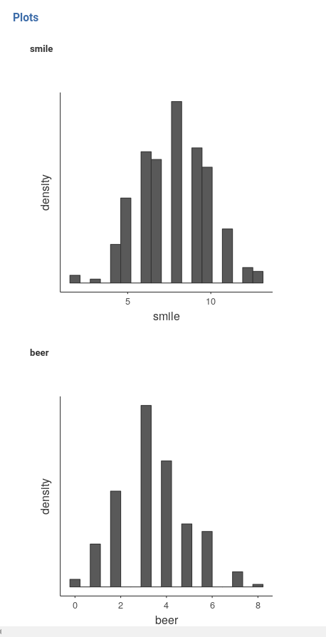
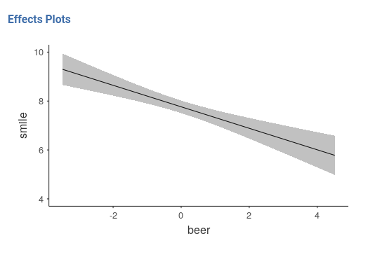
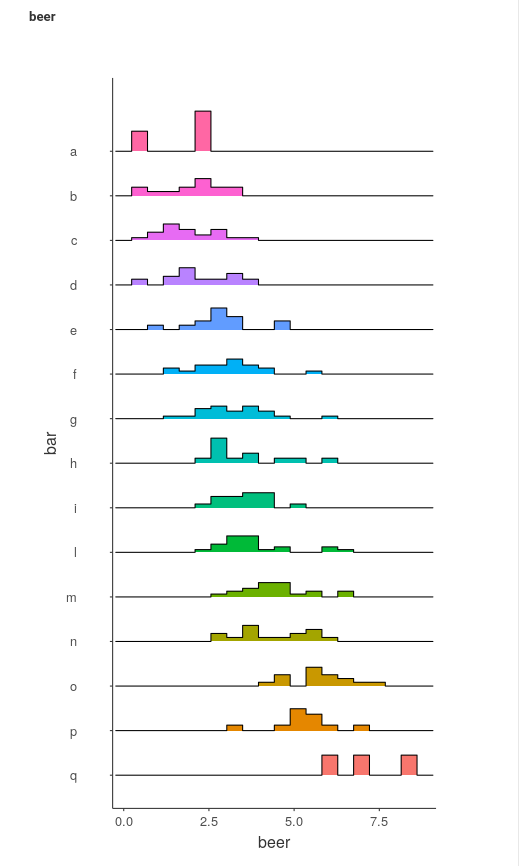
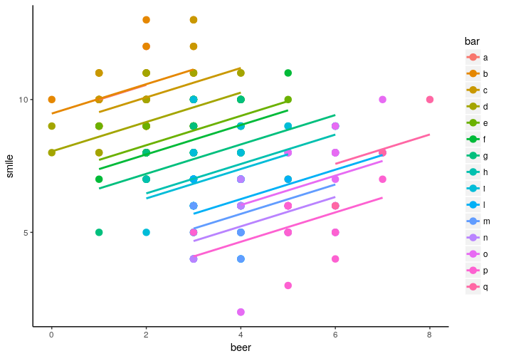
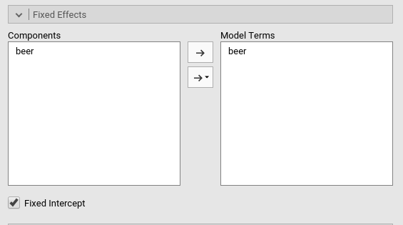
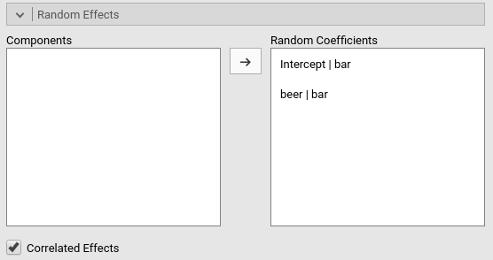
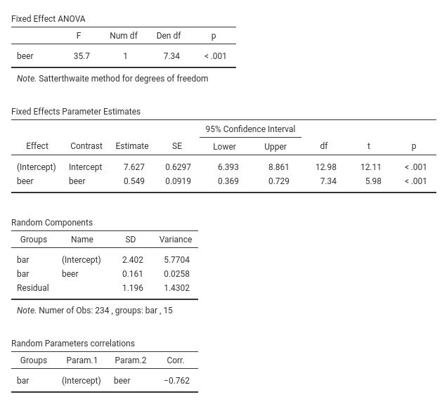

# Mixed models example: Random coefficients regression

In this example we work out the analysis of some clustered data estimating a mixed model (also called hierarchical linear model or multilevel model) on some simulated (silly) data. We use the GAMLj module in Jamovi. One can follow the example by downloading the file [beers at bars](https://github.com/mcfanda/gamlj/blob/master/data/beers_bars.csv) and open it in [jamovi](https://www.jamovi.org/download.html). Be sure to install GAMLj module from within jamovi library. The complete set of analyses and results (for the lazy reader) can be downloaded [here](https://github.com/mcfanda/gamlj/blob/master/docs/examples/beers_bars.omv)

# The research design

Immagine we sampled a number of bars (15 in this example) in a city, and in each bar we measured how many beers customers consumed that evening and how many smiles they were producing for a give time unit (say every minute). The aim of the analysis is to estimate the relationship between number of beers and number of smiles, expecting a positive relationship.

We have then 15 bars, each including a different number of participants. In the data set, the classification of customers in bars is contained in the variable `bar`. The frequencies of participants in each bar is in the next table (in jamovi descriptives, tick `frequencies table`)  .

Number of beers and number of smiles are recorded in the dataset as `beer` and `smile`, respectively, with the following descriptives and distributions.

# Understanding the problem

If we ignore for a moment the fact that we sampled customers within bars, the analytic problem would boil down to a simple regression, with `smile` as dependent variable and `beer` as independent variable. 

By looking at the scatterplot (in jamovi `Exploration` -> `scatr::Scatterplot`)

we can see that it seems to be a negative relationship between the two variables. A Simple regression ((in jamovi `Linear Models` -> `GAMLj::General Linear Model`)) confirm this impression.

The problem with this analysis is that does not consider the clustering of the data, that is, that customers are grouped across bars. If customer within a bar are more similar in their scores than customer across bars, data show dependencies and thus the GLM we ran would be biased. We have to take clustering into account.

To get the feeling of possible effects of clustering, let's first look at the distributions of `smile` and `beer` within each bar (in jamovi `Exploration` -> `Descriptives`, put `bar` in `split by` field).

We can notice that bars tend to have different means both in the `smile` and in the `beer` variables, pointing to possible dependency in the data.

Furthermote, a scatterplot highligthing the bar classification seems to suggest that the poits do get clustered by bars, and reveals that a model in which each bars is allowed to express a different regression line would fit the data much better than a model with only one regression line, fixed for every customer.

# Mixed model

The mixed model allows to obtain exactly what we need here: estimating the relationship between beers and smiles by fitting a regression line with each bar, and then averaging the regression line to obtain an overall effect of `beer` on `smile`. The mixed model accomplishes that by letting the regression coefficients to vary from cluster to cluster, thus estimating different lines for different bars.

The coefficients that vary from cluster to cluster are defined as __random coefficients__, and their mean (fixed expected value) are defined as __fixed coefficients__. 

Because a simple regression line has two coefficients (the constant term and the slope) we can let only the instercept (or constant term) to vary across cluster, only the slope, or both. Practically, we define the intercept, or the slople (`beer`), or both as random coefficients.

Because we are interested in the overall effect of `beer` on `smile`, we want the effect of beer to be **also** a fixed effect, that is slope estimated for all participants. If the beer slope is allowed to vary from bar to bar (i.e. it is set to be random), then the fixed effect should be interpreted as the __average slope__, averaged across cluster. If the beer slope is not random, then the fixed effect is simply the beer effect estimated across participants.

# Random Intercepts Model

## Set up
We start simply by allowing only the intercepts to vary. This model captures the situation depicted in the scatterplot by bars.

We can see that the regression lines plotted in the graph have different intercepts but they are all perfectly parallel, meaning that they have the same (fixed) slope. This model is called __random intercepts_ model to signal that only the intercepts are allowed to vary from cluster to cluster. 

In order to estimate the model with jamovi, we first need to set each variable in the rigth field. 

First we put `smile` in the `Dependent Variable` field and `beer` in the `covariates` field. When a variable is put in the `Covariates` field, it is treated as a continuous quantitative variable (`as.numeric()` in R). Had we had a categorical independent variable, we would have put it in "Factors", so that proper coding of the groups would be obtained (`as.factor()` in R).   

After that, we define `bar` as the clustering (grouping) variable, by putting it in the `Cluster` field.

If we now look at the results panel, we see that the model definition is not completed yet.

We need to specify the random component, that is we should set which coefficient are random. We do that by expanding the `Random Effects` tab.

On the left side, under `Components` we find all possible random effects allowed in the model already prepared by jamovi. In our example, they are the `intercept` random across bars, and the slope of `beer` random across bars. Jamovi uses the R formulation of random effects as implemented by the [lme4 R package](https://cran.r-project.org/web/packages/lme4/index.html). The bar `|` means __random across__, thus we can read the "components" as `Intercept` random across `bar`, and `beer` slope random across `bar`.

Because we decided to start with a random intercept model, we just select the first line in components and push it to the `Random Coefficients` field.

At this point, the model is estimated and the results appear in the results panel. Before inspecting the results, we have a look at the fixed effects definition, by expanding the `Fixed Effects' tab. 

Although we did not do anything about the fixed effects, jamovi automatically includes all independent variables defined in `Covariates` or in `Factor` in the fixed effects model. Obviously, when the models are complex, one can tweak the model terms to suits the analysis aim.

## Results

The first table in the output contains info about the model and the estimation.

* The `Call` row display the model in [lme4 R package](https://cran.r-project.org/web/packages/lme4/index.html) formulation. This can be useful to re-run the same analysis in R (not using GAMLj module). 
* The `AIC` row display the Aikeke Information Criterion, which can be useful to evaluate the model, especially in comparison with other models. Details can be found in [GAMLj docs](https://github.com/mcfanda/gamlj/blob/master/docs/mixed_specs.html) and in [Zuur et. al , 2009] al.](http://www.springer.com/la/book/9780387874579)
* R-marginal and R-conditional are proportion of reduced error, or pseudo-$R^2$. They are described in [Johnson (2014)](http://onlinelibrary.wiley.com/doi/10.1111/2041-210X.12225/abstract;jsessionid=2018A0141FC9ABFF1B654117812A8FCA.f03t01) and implemented in [piecewiseSEM](https://github.com/jslefche/piecewiseSEM/blob/master/README.md#get-r2-for-individual-models). For our purposes, we can interpret them as follows: __R-marginal__ is the variance explained by the fixed effects over the total (expected) variance of the dependent variable. The __R-conditional__ is the variance explained by the fixed and the random effects together over the total (expected) variance of the dependent variable. In our example, the fixed effects do not explain much (.089), but the overall model (fixed+random) capture a fairly big share of the variance (.817).

`Fixed effects ANOVA` gives the F-tests associated with the model fixed effects. Here we see that `beer` has a statistical significant effect (on average) on number of smiles.

As regards the degrees of freedom (nobody cares about them, I know), jamovi mixed model tries to use Satterthwaite approximation as much as possible, but for complex models it may fail. When that happens, Kenword-Roger approximation is used and, if the latter does not fail, F-tests are computed. A note signals which approximation is used.

`Fixed effects Parameters Estimates` gives the fixed B coefficients, the fixed (average) intercept, t-tests associated with the model fixed effects. Accordingly, we can say that averaging across bars,  `beer` has a statistical significant effect  on number of smiles, such that for each beer more, people smiles 0.548 smiles more.

As regards the intercept (which people usually ignore) we should interpret it as the expected number of smiles for the average number of beers drunken. This can be surprising because one expects the interecept to be the expected value of Y when X=0. It is, of course, also here but jomovi mixed model module center the continuous variables by default. Thus, X=0 mean X=mean. Indeed, in the `Covariates Scaling` tab we see that:

Options are available to scale the covariates, by centering it or standardizing it. The options "cluster-based" operate the re-scaling (centering or standardizing) within each cluster rather than on the sample as a whole.

The **Random Component** display the variances and SD of the random coefficients, in this case of the random intercepts. From the table we can see that there is a good variance of the intercepts (${\sigma_a}^2$=5.77), thus we did well in letting the intercepts vary from cluster to cluster. (${\sigma_a}^2$=5.77) can be reported as an intra-class correlation by dividing it by the sum of itself and the residual variace ($\sigma^2$), that is $v_{ic}={{\sigma_a}^2 \over {{\sigma_a}^2+{\sigma}^2}}$

# Random Slopes Model

## Set up

We can now expand the model by letting the slopes to vary as weel. We just need to update the definition of the random coefficients in the `Random Effects` tab, adding also the `beer|bar` term.

Notice that we have now two random effects, that can be correlated or fixed to be uncorrelated (i.e. variance components model). The option `Correlated Effects` set up the correlation of the random effects. In this version of GAMLj module, the random coefficients can be either all correlated or all not correlated. Future versions will allow more freedom in the definition of the random covariance structure. People experienced in SPSS Mixed would recognize these two options to be  `UN` and `VC` in SPSS syntax, respectively.

## Results

Results are substantially the same, showing that the variability of the slopes do no influence the interpretation of the results in a substantial way. We can notice, however, that the DF of the tests are different as compared with the random intercepts model. This is due to the fact that now the fixed slope 0.584 is computed as the average of the random slopes, and thus its inferential sample is much smaller. 

In the 'Random Components' table we see a small variance of beer ${\sigma_b}^2$=1.4302, indicating that slopes do not vary much. Nontheless, their variability it is not null, so allowing them to be random increases our model fit. This is also testified by a (slightly) smaller AIC (from 811 to 809) and a larger $R^2$-conditional (from .81 to .82). Because we do not test any inferential hypothesis on these variances, it is better to keep them in the model. As they say: _if it ain't  broken, don't fix it_.

Finally, a correlation between intercepts and slopes can be observed, $r$=-.762, indicating that bars where people smile more on average (intercept) are the bars were the effect of beer is smaller.

The final model, with random intercepts and slopes, would capture the data with several slopes, with very different intercepts and slightly varianble slopes.

